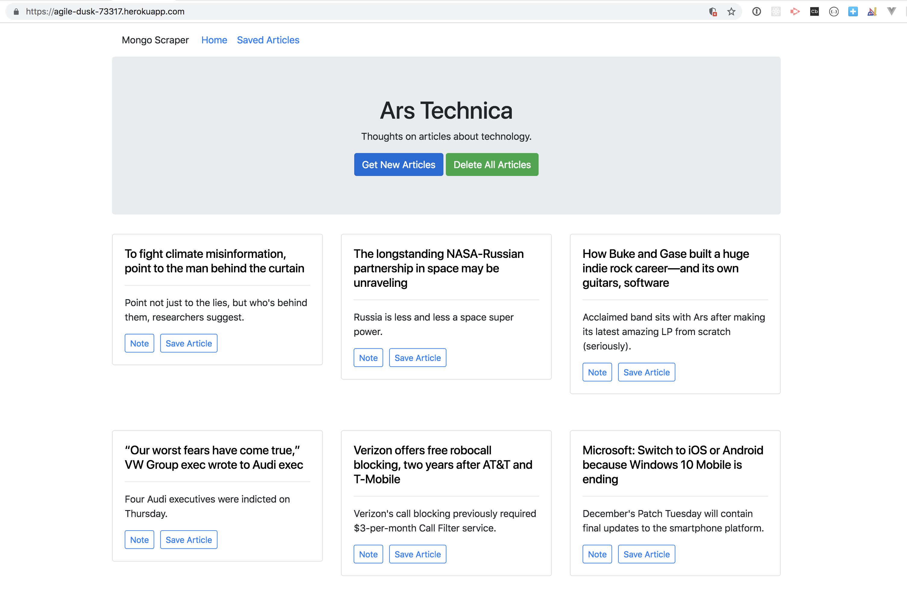
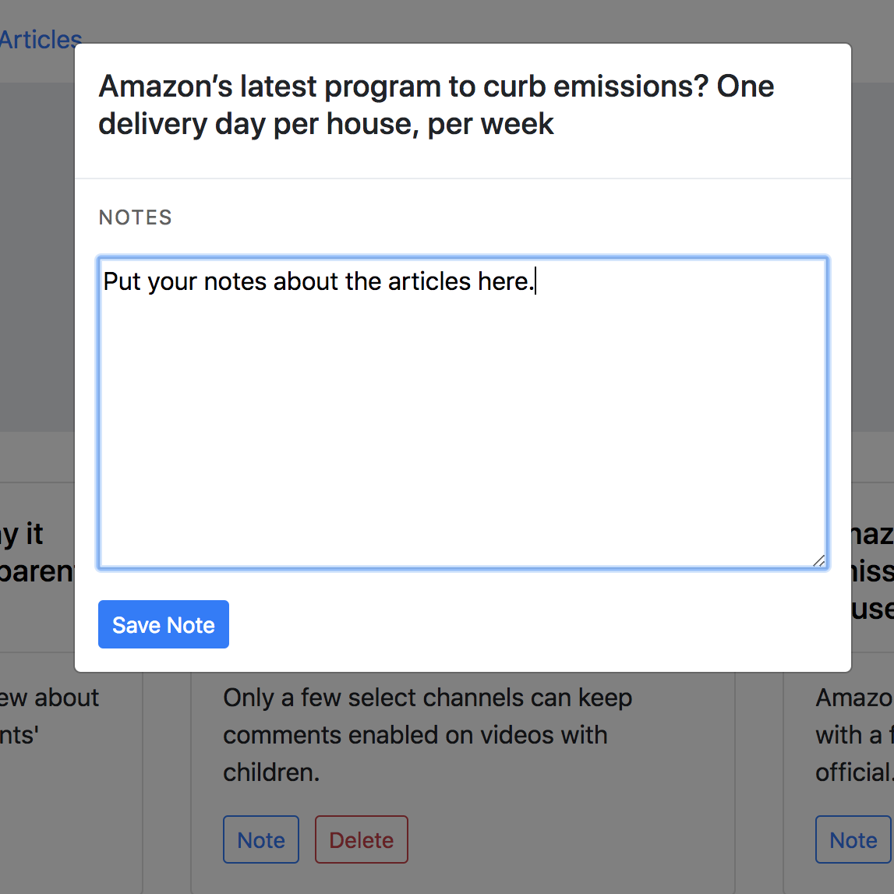

# Mongo-Scraper

## Overview
- Mongo Scraper is a web application that utilizes Mongoose and Cheerio to scrape articles from Ars Technica, and allows users to save articles and to make notes.

## Live Site
- https://agile-dusk-73317.herokuapp.com/

## Description
Whenever a user visits https://agile-dusk-73317.herokuapp.com/, the app displays already scraped stories from a Ars Technica - https://arstechnica.com/. 

Each scraped article is bsaved to the application database. The app scrapes and displays the following information for each article:

 * Headline - the title of the article
 * Excerpt/Summary - a short summary of the article
 * URL - the url to the original article (The headline is linked to the article.)

Users can get/scrape more articles.

Users can delete all articles and the associated notes.

Users can also be save notes on articles.  

The notes are saved to the database as well, and associated with their articles, allowing them to be displayed to other visitors and for users to revisit them. 

Users can also delete comments left on articles. All stored comments are visible to every user and therefore can be updated or deleted by any user.

Users can unsave an article.

## Technologies Used
BOOTSTRAP
- https://getbootstrap.com/docs/4.0/components/buttons/
- https://getbootstrap.com/docs/4.0/components/card/
- https://getbootstrap.com/docs/4.0/components/jumbotron/
- https://getbootstrap.com/docs/4.0/components/modal/

- node - https://www.npmjs.com/package/node
- mongoDB - https://www.mongodb.com/
- express NPM Package - https://www.npmjs.com/package/express
- express-handlebars - https://www.npmjs.com/package/express-handlebars
- mongoose - https://www.npmjs.com/package/mongoose
- axios - https://www.npmjs.com/package/axios
- cheerio NPM Package - https://www.npmjs.com/package/cheerio
- morgan NPM Package - https://www.npmjs.com/package/morgan

